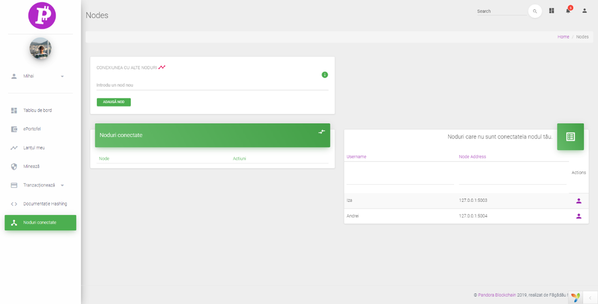
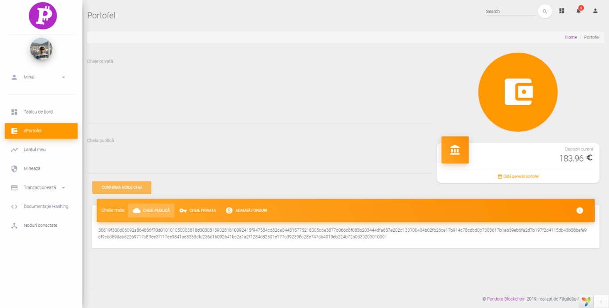

# Pandora Web Exchange
An exchange developed in PHP that works as an API Client for the Pandora network.

## Description

Decentralization is a term frequently used in the cryptoeconomic space, not fully understood and interpreted in various ways among great economists.

Through this project, I wanted to provide a detailed understanding of the processes underlying a decentralized network, how it can be used and in what field it can be developed. Thus, the project provided information on the theoretical aspects of the blockchain and decentralized networks that are a starting point for a new capitalist revolution and an introduction to the development of a network that can work with a web application.

The project was developed using two technologies. Python and PHP. PHP used for building the web application and acted as a client for the decentralized nodes. The nodes (building blocks of the network) were developed in Python as microservices.

## Screenshots
### Nodes page

### Wallet page

